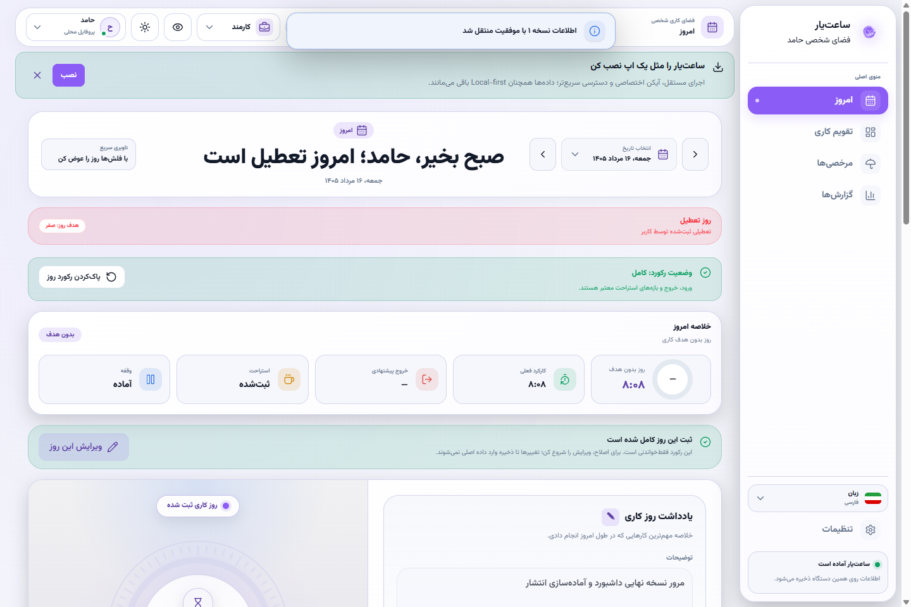
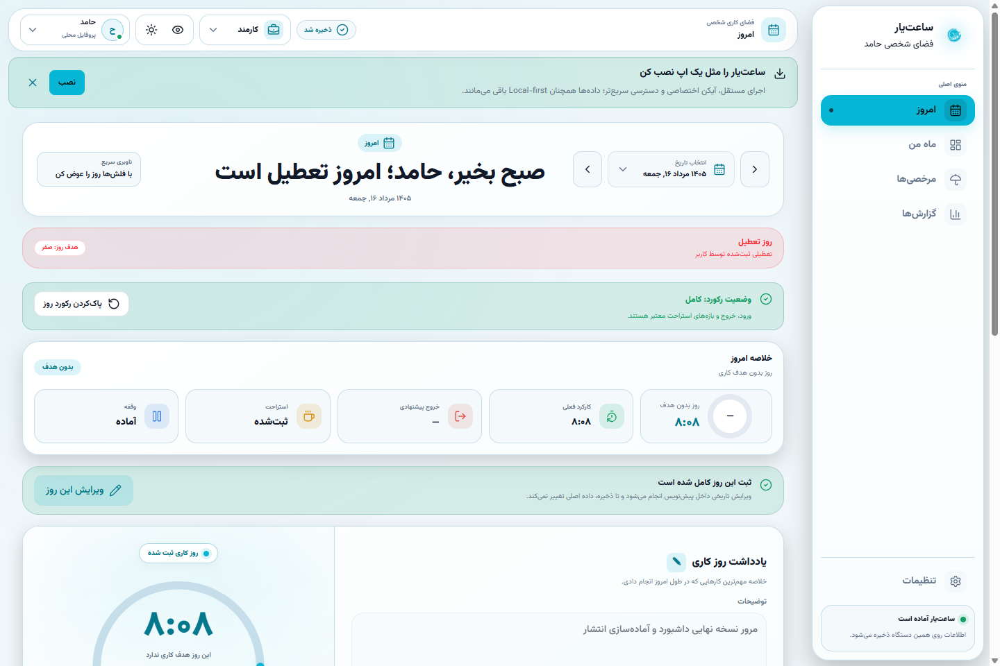
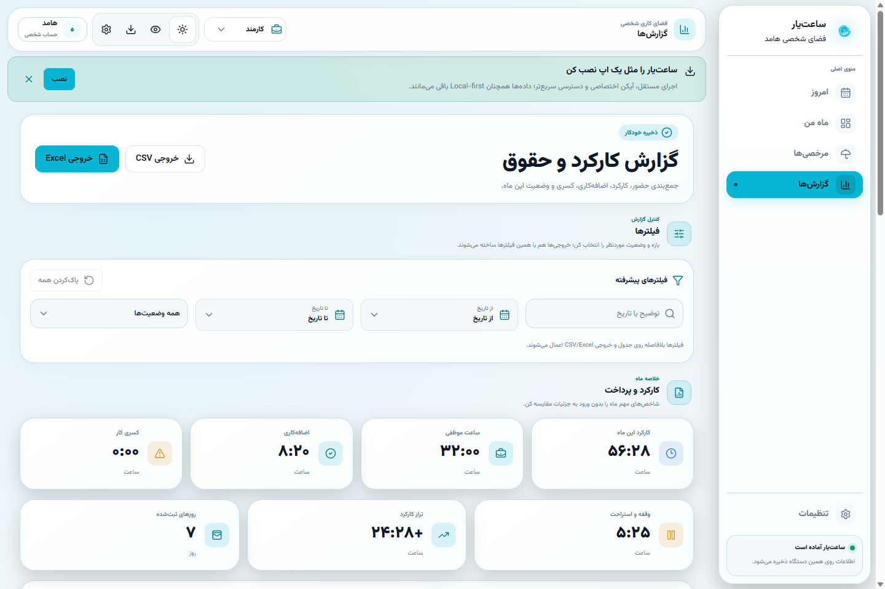
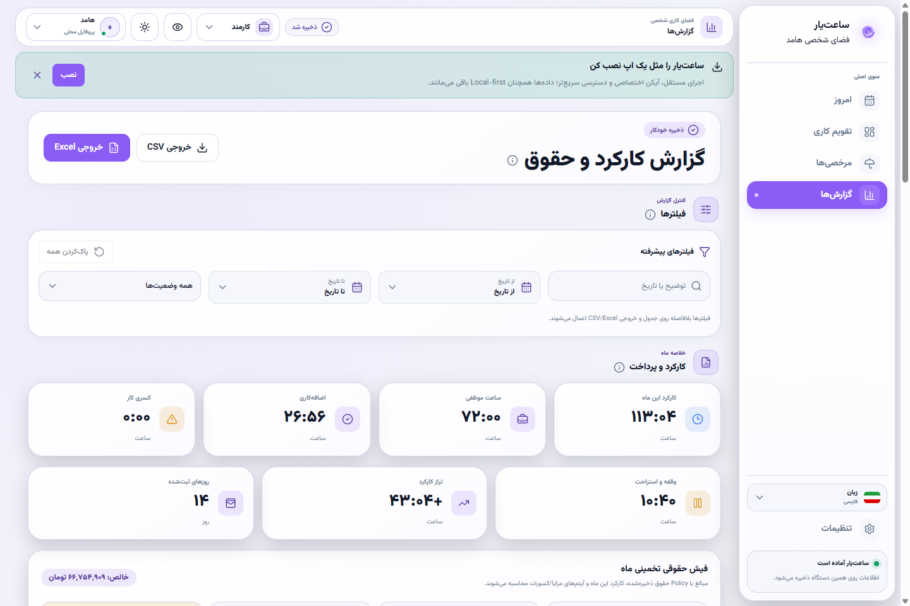
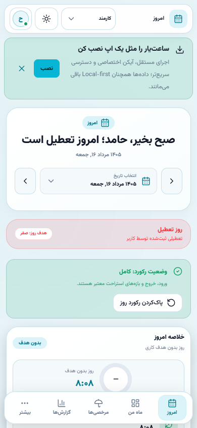

<div align="center" dir="rtl">


# ساعت‌یار

### وب‌اپ فارسی و Local-first برای ثبت زمان، کارکرد، حقوق، پروژه و درآمد

[](#کنترل-کیفیت)
[](https://nextjs.org/)
[](https://www.typescriptlang.org/)
[](./LICENSE)
[](#ویژگیها)

[English](./README.md) · [نسخه آنلاین](https://saat-yar.vercel.app) · [راهنمای اجرا](./RUN_AND_DEPLOY_FA.md) · [مشارکت](./CONTRIBUTING.md) · [حمایت مالی](https://daramet.com/hamedtkd)

</div>

---

## ساعت‌یار چیست؟

ساعت‌یار یک وب‌اپ متن‌باز، فارسی، راست‌به‌چپ و **Local-first** برای مدیریت زمان و کار روزانه است. کارمند، فریلنسر یا کاربر ترکیبی می‌تواند بدون ساخت حساب کاربری و بدون وابستگی به سرور، ساعت ورود و خروج، ناهار، وقفه، مرخصی، پروژه، صورتحساب و گزارش مالی خود را ثبت کند.

داده‌های اصلی در مرورگر خود کاربر و داخل IndexedDB نگهداری می‌شوند. برنامه برای استفاده روزمره به Backend، حساب ابری یا فایل `.env` نیاز ندارد.

> Saatyar is an open-source, Persian-first, RTL, local-first worklog and time-tracking web app for employees, freelancers, and hybrid workers.

## نسخه آنلاین

نسخه عمومی برنامه در این آدرس در دسترس است:

**https://saat-yar.vercel.app**

برای اطلاعات واقعی و بلندمدت، پس از ورود به برنامه حتماً از بخش «داده و پشتیبان» یک نسخه پشتیبان JSON بسازید.

## نمای محصول

تصاویر زیر از Build واقعی ساعت‌یار و Fixture نمایشی مستقل ساخته شده‌اند؛ Capture رسانه به داده واقعی کاربر دسترسی ندارد.

<p align="center">
  
</p>

<table>
  <tr>
    <td width="50%"></td>
    <td width="50%"></td>
  </tr>
  <tr>
    <td width="50%"></td>
    <td width="50%"></td>
  </tr>
</table>

### دموی کوتاه Onboarding

<p align="center">
  
</p>

رسانه‌ها با `npm run media:capture` قابل بازتولید هستند. جزئیات در [docs/assets/README.md](./docs/assets/README.md) آمده است.

## ویژگی‌ها

### ثبت زمان و حضور

- شروع و پایان روز کاری
- ثبت ناهار با حقوق یا بدون حقوق
- ثبت چند وقفه مستقل
- ویرایش دقیق ساعت شروع، پایان و مدت وقفه‌ها
- محاسبه شیفت‌هایی که از نیمه‌شب عبور می‌کنند
- خروج پیشنهادی بر اساس برنامه همان روز
- بازیابی نشست بازمانده و علامت‌گذاری برای بررسی کاربر
- یادآوری استراحت دوره‌ای و اعلان تایمر باز

### حالت‌های کاری

- **کارمند:** حضور، موظفی، اضافه‌کاری، کسری، مرخصی و حقوق
- **فریلنسر:** مشتری، پروژه، نرخ ساعتی، بودجه، هزینه و صورتحساب
- **ترکیبی:** دسترسی هم‌زمان به قابلیت‌های کارمندی و فریلنسری

### برنامه کاری و حقوق

- برنامه مستقل برای هر روز هفته
- هدف هفتگی قابل تنظیم و توزیع میان روزهای فعال
- روش حقوق قابل انتخاب: ماهانه متناسب، ماهانه ثابت، ساعتی یا روزکاری
- تنظیم مستقل اضافه‌کاری، تعطیل‌کاری، کسرکار و گردکردن مبلغ
- تشخیص تعطیلات رسمی و تعطیل هفتگی
- Preview زنده و Breakdown شفاف حقوق، مزایا، کسورات و خالص پرداختی

### گزارش و مدیریت داده

- گزارش ماهانه کارکرد، موظفی، اضافه‌کاری و کسری
- نقشه فعالیت ماهانه شبیه GitHub با ناوبری صفحه‌کلید، streak و هوشمندی اضافه‌کار/کسری
- جزئیات روزانه و فیلتر رکوردها
- خروجی CSV و Excel
- چاپ و PDF سازگار با A4
- Backup و Restore نسخه‌بندی‌شده
- Migration خودکار داده‌های قدیمی
- نسخه بازیابی محلی برای کاهش ریسک ازدست‌رفتن اطلاعات
- انتقال مستقیم و رمزنگاری‌شده داده بین موبایل و لپ‌تاپ با WebRTC و Pairing QR محلی

### تجربه کاربری

- رابط دوزبانه فارسی/RTL و انگلیسی/LTR با تغییر سریع زبان از کنترل پرچم
- تقویم وابسته به زبان در حالت خودکار، با امکان انتخاب مستقل شمسی/جلالی یا میلادی
- تم روشن، تاریک و پیروی از سیستم
- چند Accent و سطح ظاهری قابل انتخاب
- فونت Vazirmatn به‌صورت محلی
- طراحی Responsive برای موبایل و دسکتاپ
- دسترسی‌پذیری کیبورد، Focus management و Reduced motion
- PWA با نصب داخل برنامه، Offline shell و اعلان امن نسخه جدید

## حریم خصوصی و مدل Local-first

ساعت‌یار به‌صورت پیش‌فرض اطلاعات کاری شما را به سرور ارسال نمی‌کند. داده‌ها در همان مرورگر و همان دامنه ذخیره می‌شوند.

این مدل مزایای مهمی دارد:

- نیاز نداشتن به ثبت‌نام و حساب کاربری
- کنترل مستقیم کاربر روی اطلاعات
- کارکرد اصلی بدون وابستگی دائمی به اینترنت
- نبود پایگاه داده مرکزی حاوی اطلاعات شخصی کاربران

اما یک محدودیت مهم هم دارد: پاک‌کردن داده‌های سایت، تعویض مرورگر یا دستگاه، استفاده از حالت Private و تغییر دامنه می‌تواند باعث ازدست‌رفتن اطلاعات محلی شود. برای استفاده جدی، Backup منظم ضروری است.

## شروع سریع

### پیش‌نیازها

- Node.js `22.x`
- npm همراه Node.js
- Git برای دریافت سورس

### دریافت و اجرا

```bash
git clone https://github.com/hamedtkd/saat-yar.git
cd saat-yar
npm ci
npm run dev
```

محیط توسعه محلی پیش‌فرض با Next.js اجرا می‌شود و معمولاً در این آدرس است:

```text
http://localhost:3000
```

اگر مشخصاً به محیط اختیاری Vite/Vinext نیاز داری، اجرا کن:

```bash
npm run dev:vinext
```

Vite/Vinext معمولاً روی `http://localhost:5173` اجرا می‌شود. دستور `npm run dev:next` نیز به‌عنوان نام مستعار صریح برای همان محیط پیش‌فرض Next.js باقی مانده است.

## دستورات مهم

| دستور | کاربرد |
| --- | --- |
| `npm ci` | نصب دقیق Dependencyها از Lockfile |
| `npm run dev` | اجرای پایدار محیط توسعه محلی با Next.js |
| `npm run dev:next` | نام مستعار صریح برای محیط توسعه پیش‌فرض Next.js |
| `npm run dev:vinext` | اجرای اختیاری محیط توسعه Vite/Vinext |
| `npm run check:dependencies` | بررسی نصب بودن Dependencyهای مستقیم پس از دریافت فاز جدید |
| `npm run typecheck` | بررسی TypeScript بدون تولید خروجی |
| `npm run lint` | اجرای ESLint با صفر Warning مجاز |
| `npm test` | اجرای تست‌های منطق و معماری |
| `npm run check` | پاک‌سازی فایل‌های قدیمی، Import check، Typecheck، Lint و Test |
| `npm run check:quality` | اجرای تمام کنترل‌های کیفیت و Build نهایی Next.js |
| `npm run test:browser:production` | Build خروجی Static و اجرای Smoke Test واقعی در Chrome، Edge یا Chromium |
| `npm run check:release` | Quality کامل و سپس Smoke Test مرورگر روی همان Build |
| `npm run test:browser:pairing` | Smoke واقعی WebRTC برای انتقال چند chunk رمزنگاری‌شده و ACK |
| `npm run audit:vercel` | بررسی محلی قرارداد Static Export و انتشار `out/` روی Vercel |
| `npm run audit:production` | Audit read-only دامنه Deploy‌شده، Routeها، PWA، Service Worker، robots و sitemap |
| `npm run media:capture` | بازتولید Screenshot/GIFهای محصول با دیتای نمایشی مستقل |
| `npm run build:pages` | ساخت خروجی Static |
| `npm run build:vercel` | Build مناسب Vercel |
| `npm start` | اجرای خروجی Vinext |

برای بررسی کامل قبل از Push:

```bash
npm run check:quality
```

## منطق محاسبه زمان

```text
زمان حضور = خروج − ورود
کارکرد خالص = زمان حضور − ناهار بدون حقوق − وقفه‌های بدون حقوق
زمان قابل محاسبه = کارکرد خالص + مرخصی قابل محاسبه
تراز روز = زمان قابل محاسبه − هدف همان روز
```

ناهار یا وقفه «با حقوق» از کارکرد خالص کم نمی‌شود. برای رکوردهای ویرایش‌شده دستی، ساعت‌های همان روز مبنای محاسبه هستند تا Timestamp قدیمی باعث اضافه‌کاری چندروزه نشود.

## منطق حقوق

موتور حقوق Rule-based است و می‌تواند بر اساس Policy ذخیره‌شده، پایه حقوق را به‌صورت ماهانه متناسب، ماهانه ثابت، ساعتی یا روزکاری محاسبه کند. اضافه‌کاری و تعطیل‌کاری می‌توانند ضریب نرخ پایه، نرخ ثابت ساعتی یا غیرفعال باشند و کسرکار و گردکردن مبلغ نیز مستقل تنظیم می‌شوند.

Preset سازگار با نسخه‌های قدیمی همچنان رفتار «حقوق ماهانه ÷ ۳۰» و محاسبه متناسب با کارکرد را حفظ می‌کند.

> محاسبات ساعت‌یار یک ابزار شخصی و تخمینی است و جایگزین قرارداد استخدام، فیش رسمی حقوق، نظر حسابدار یا قوانین محل کار نیست.

## معماری پروژه

```text
app/                           Routeها و Layout برنامه
components/
  common/                      اجزای مشترک محصول
  layout/                      Shell، Header، Navigation و Onboarding
  pages/                       قابلیت‌های Today، Month، Reports و Settings
  pickers/                     انتخابگرهای تاریخ و زمان
  ui/                          Primitiveهای رابط کاربری
hooks/
  controller/                  عملیات و Workflowهای برنامه
  settings/                    Draft و ویرایش تنظیمات
  use-saatyar-controller.ts    Facade اصلی State محصول
  use-persisted-app-data.ts    بارگذاری و ذخیره Local-first
lib/
  data/                        Migration، Normalization و Version
  time-engine.ts               موتور محاسبه زمان
  payroll.ts                   محاسبات حقوق
  work-schedule.ts             برنامه هفتگی و هدف روزانه
  backup-schema.ts             اعتبارسنجی Backup
  storage.ts                   Adapter ذخیره‌سازی IndexedDB
  types.ts                     قراردادهای دامنه
  format.ts                    قالب‌بندی فارسی
scripts/                       Build و Quality utilities
tests/                         تست‌های دامنه، Regression و معماری
```

## ذخیره‌سازی و Migration

نسخه Schema داده در `lib/data/version.ts` تعریف می‌شود. هر تغییر ناسازگار باید همراه این موارد باشد:

1. افزایش نسخه Schema
2. Migration مرحله‌ای
3. Normalization داده
4. اعتبارسنجی Backup
5. تست Regression

جزئیات بیشتر در [docs/DATA_MIGRATIONS.md](./docs/DATA_MIGRATIONS.md) قرار دارد.

## کنترل کیفیت

پروژه برای جلوگیری از Regression از چند لایه کنترل استفاده می‌کند:

- بررسی تمام Importهای محلی
- TypeScript strict validation
- ESLint با `--max-warnings=0`
- تست‌های منطق زمان، حقوق، Backup و Migration
- تست‌های معماری و سقف ۲۵۰ خط برای فایل‌های Production
- تست‌های Theme و Semantic token
- Build نهایی Next.js و prerender تمام Routeها
- Smoke Test مرورگر واقعی برای بارگذاری اولیه، تکمیل Onboarding و تغییر تاریخ

کنترل کیفیت پروژه شامل بیش از **۶۰۰ تست منطق، Regression، معماری و قرارداد مخزن**، Audit قرارداد داده، Build کامل Next.js، Smoke آفلاین PWA و Browser Journeyهای واقعی فریلنسر و کارمند است.

## سیاست رابط و Style

- کلاس‌های Tailwind کنار Markup همان Component نوشته می‌شوند.
- رنگ‌های ثابت در بخش‌های اصلی مجاز نیستند و UI باید از Semantic tokenها استفاده کند.
- فایل Style Registry مرکزی مانند `lib/tw.ts` وجود ندارد.
- `app/globals.css` فقط Styleهای سراسری، Tokenها و قواعد چاپ را نگهداری می‌کند.
- فایل‌های Production تا حد ممکن زیر ۲۵۰ خط باقی می‌مانند.

## استقرار

راهنمای مرحله‌ای Windows، macOS، Linux، Docker، GitHub Pages و Vercel در فایل زیر قرار دارد:

[راهنمای اجرا و استقرار](./RUN_AND_DEPLOY_FA.md)

- [عیب‌یابی Windows و خطاهای npm](./docs/TROUBLESHOOTING_FA.md)
- [جدول سازگاری مرورگر و محدودیت‌های Notification/PWA](./docs/BROWSER_COMPATIBILITY.md)
- [یادداشت Release Candidate ساعت‌یار ۲.۶.۰](./docs/releases/RELEASE_NOTES_2.6.0_FA.md)
- [یادداشت آخرین Release پایدار ساعت‌یار ۲.۵.۰](./docs/releases/RELEASE_NOTES_2.5.0_FA.md)
- [یادداشت Release تاریخی ساعت‌یار ۲.۴.۰](./docs/releases/RELEASE_NOTES_2.4.0_FA.md)
- [انتشار تاریخی ساعت‌یار ۲.۳.۲](./docs/releases/RELEASE_NOTES_2.3.2_FA.md)
- [یادداشت انتشار تاریخی ۲.۳.۱](./docs/releases/RELEASE_NOTES_2.3.1_FA.md)
- [یادداشت انتشار تاریخی ۲.۳.۰](./docs/releases/RELEASE_NOTES_2.3.0_FA.md)
- [یادداشت انتشار تاریخی ۲.۲.۰](./docs/releases/RELEASE_NOTES_2.2.0_FA.md)
- [یادداشت انتشار تاریخی ۲.۱.۰](./docs/releases/RELEASE_NOTES_2.1.0_FA.md)

## مشارکت

Issue، پیشنهاد UX، گزارش باگ و Pull Request خوش‌آمد است.

پیش از Pull Request:

```bash
npm ci
npm run check:quality
npm run test:browser:production
```

سپس دستورالعمل [CONTRIBUTING.md](./CONTRIBUTING.md) را مطالعه کنید. آسیب‌پذیری امنیتی نباید در Issue عمومی منتشر شود؛ روش گزارش مسئولانه در [SECURITY.md](./SECURITY.md) آمده است.

## نقشه راه

## Release Candidate ۲.۶.۰

**Release Candidate ۲.۶.۰** تغییرات پس از ۲.۵.۰، یعنی فازهای ۱۹۵ تا ۲۰۰ را روی AppData v21 بسته‌بندی می‌کند. Candidate فعلاً روی `dev` می‌ماند و انتقال به Production و tag `v2.6.0` فقط در Phase 202 انجام می‌شود. [یادداشت RC ۲.۶.۰](./docs/releases/RELEASE_NOTES_2.6.0_FA.md)

نسخه **۲.۵.۰** آخرین Release پایدار ساعت‌یار است و تغییرات فازهای ۱۶۶ تا ۱۸۰ را بسته‌بندی می‌کند: آنبوردینگ مستقل و قابل‌بازیابی، اصلاح سهمیه مرخصی، بازخورد ویرایش روز تکمیل‌شده، Import Wizard، Runtime Clock مشترک، تکمیل فارسی RTL / انگلیسی LTR و قرارداد Final Release.

Baseline نهایی Phase 200 روی `15f5af8` با **۹۵۸/۹۵۸ تست**، Full Browser/Pairing Gate، Hardening Audit، Vercel Audit و Build کامل ۳۷ route بسته شده است. Candidate فعلی روی **Schema v21** قرار دارد و قرارداد منتشرشده ۲.۵.۰ روی Schema v20 تاریخی و immutable باقی می‌ماند. جزئیات در [یادداشت RC ۲.۶.۰](./docs/releases/RELEASE_NOTES_2.6.0_FA.md)، [فهرست قابلیت‌های نسخه بعدی](./docs/releases/NEXT_RELEASE_FEATURES_FA.md) و [نقشه راه](./docs/roadmap/BACKLOG_FA.md) ثبت شده‌اند.

Phase 201 فقط Candidate را بسته‌بندی می‌کند. انتقال Candidate تأییدشده به `main`، Production Audit و Tag annotated `v2.6.0` فقط در Phase 202 انجام می‌شود. Manifest و Tagهای Releaseهای قبلی تاریخی و immutable باقی می‌مانند.

## حمایت مالی

ساعت‌یار رایگان و متن‌باز باقی می‌ماند. اگر برنامه برایتان مفید بوده و مایلید از ادامه توسعه، تست و نگهداری آن حمایت کنید، می‌توانید به‌صورت کاملاً اختیاری از صفحه زیر استفاده کنید:

### [حمایت از توسعه ساعت‌یار در دارمت](https://daramet.com/hamedtkd)

حمایت مالی هیچ قابلیت اضافه‌ای را باز نمی‌کند و برای استفاده از برنامه الزامی نیست.

## مجوز

این پروژه تحت مجوز [MIT](./LICENSE) منتشر شده است. استفاده، تغییر و توزیع آن طبق شرایط این مجوز آزاد است.

## نویسنده

توسعه و نگهداری: **Hamed Ahmadi — hamedtkd**

- GitHub: [hamedtkd](https://github.com/hamedtkd)
- حمایت مالی: [daramet.com/hamedtkd](https://daramet.com/hamedtkd)

---

<div align="center" dir="rtl">

اگر ساعت‌یار برایتان مفید است، Star دادن به مخزن و معرفی آن به دیگران نیز کمک بزرگی است.

</div>
